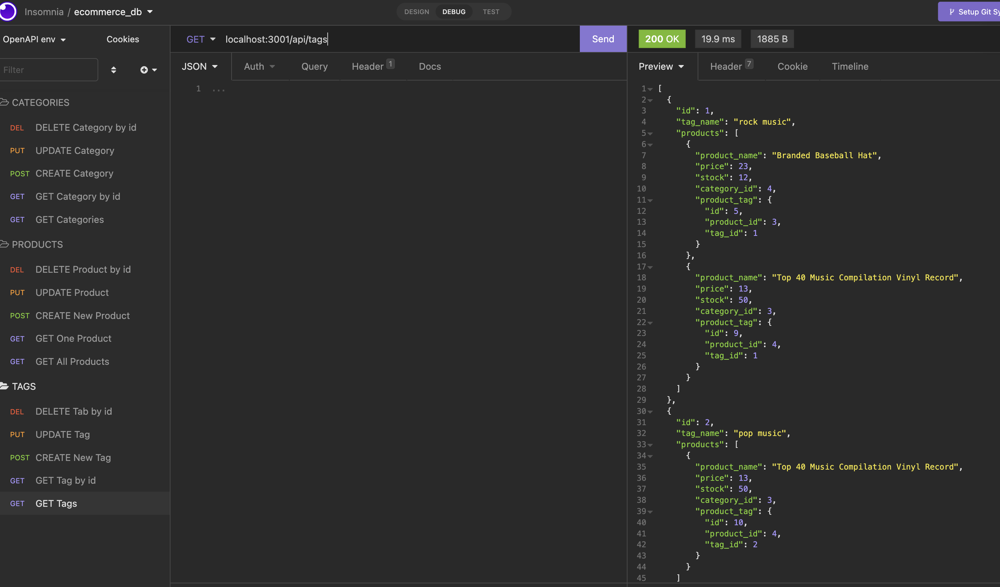
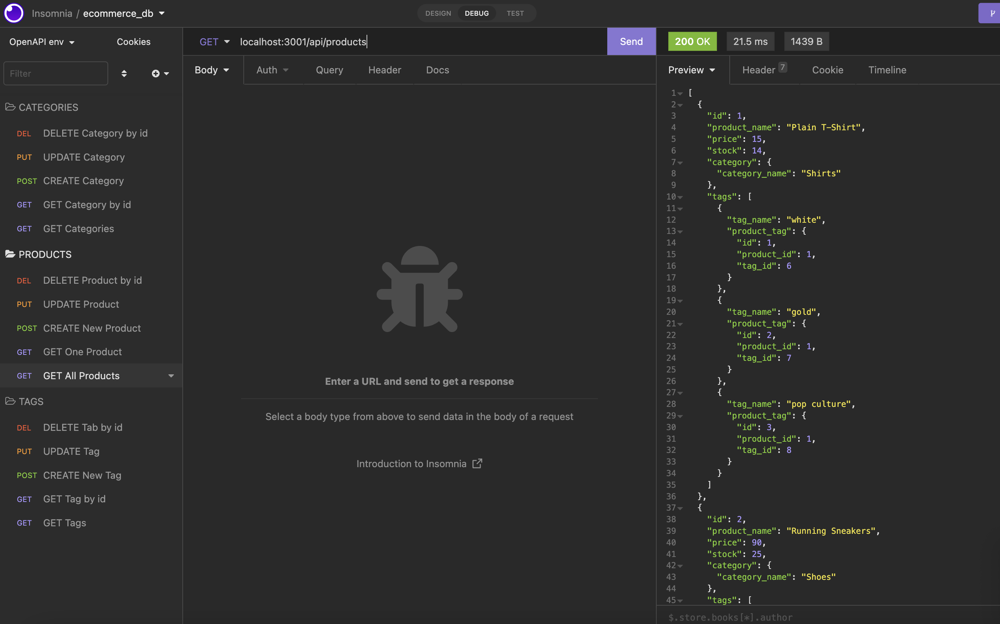
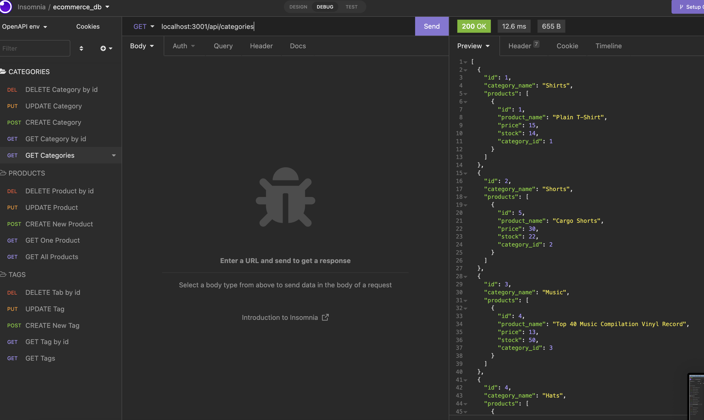

# E-commerce Back End Challenge

## Table of Contents

- [Description](#description)
- [User Story](#user-story)
- [Acceptance Criteria](#acceptance-criteria)
- [Installation](#installation)
- [Usage](#usage)
- [Contribution](#contribution)
- [Questions](#questions)

## Description

This is the back end portion of an e-commerce website that uses Express.js and Sequelize to interact with a MySQL database.

## User Story

```md
AS A manager at an internet retail company
I WANT a back end for my e-commerce website that uses the latest technologies
SO THAT my company can compete with other e-commerce companies
```

## Acceptance Criteria

```md
GIVEN a functional Express.js API
WHEN I add my database name, MySQL username, and MySQL password to an environment variable file
THEN I am able to connect to a database using Sequelize
WHEN I enter schema and seed commands
THEN a development database is created and is seeded with test data
WHEN I enter the command to invoke the application
THEN my server is started and the Sequelize models are synced to the MySQL database
WHEN I open API GET routes in Insomnia for categories, products, or tags
THEN the data for each of these routes is displayed in a formatted JSON
WHEN I test API POST, PUT, and DELETE routes in Insomnia
THEN I am able to successfully create, update, and delete data in my database
```

## Installation

```md
mysql -u root -p
Enter Password when prompted
source db/schema.sql
npm run seed
npm start
```

## Usage





Video Link: https://drive.google.com/open?id=1vrRaQAbUOi48yQBb0iZxxyrionYahWfB&authuser=tab61295%40gmail.com&usp=drive_fs

## Contributing

If you are interested in future development, please reach via email or Github!

## Questions

If you have any questions, please feel free to reach out!

Github username: Theresa2013

Github Email: tab61295@gmail.com
